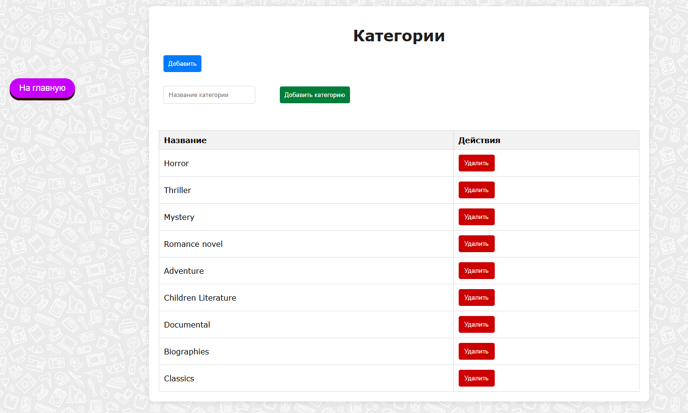

# Информационно-справочная система библиотеки

- Java
- Spring Boot
- Thymeleaf


### База данных
```
CREATE TABLE IF NOT EXISTS categories (
    id SERIAL PRIMARY KEY,
    name VARCHAR(100) NOT NULL UNIQUE
);

CREATE TABLE IF NOT EXISTS books (
    id SERIAL PRIMARY KEY,
    author VARCHAR(100) NOT NULL,
    category_id INT REFERENCES categories(id) ON DELETE SET NULL,
    title VARCHAR(100) NOT NULL UNIQUE,
    publication_year INT NOT NULL
);

CREATE TABLE IF NOT EXISTS readers (
    id SERIAL PRIMARY KEY,
    first_name VARCHAR(100) NOT NULL,
    last_name VARCHAR(100) NOT NULL,
    phone_number VARCHAR(100) NOT NULL UNIQUE,
    email VARCHAR(100)
);

CREATE TABLE IF NOT EXISTS borrowings (
    id SERIAL PRIMARY KEY,
    reader_id INT REFERENCES readers(id) ON DELETE SET NULL,
    book_id INT REFERENCES books(id) ON DELETE SET NULL,
    borrow_date TIMESTAMP DEFAULT CURRENT_TIMESTAMP,
    borrowed BOOLEAN NOT NULL
);
```

## ER-диаграмма


## Страницы веб-приложения





